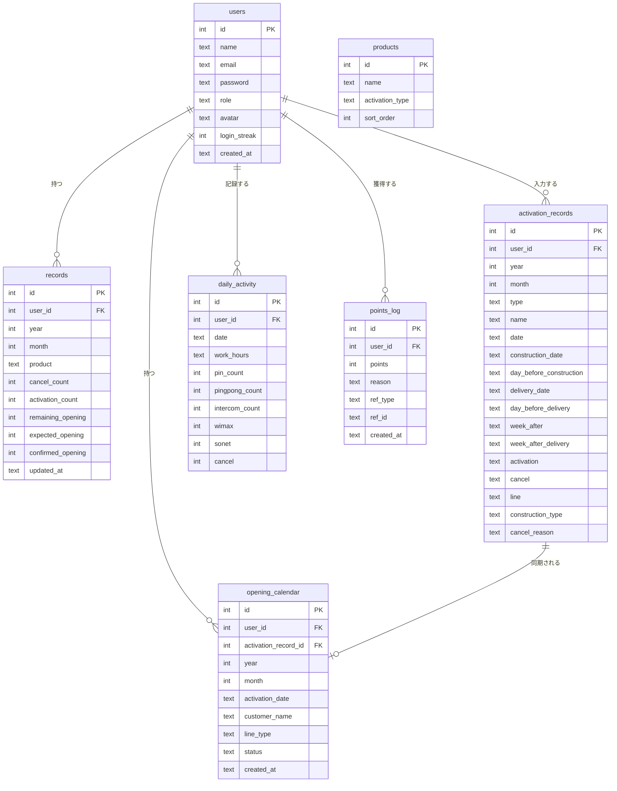
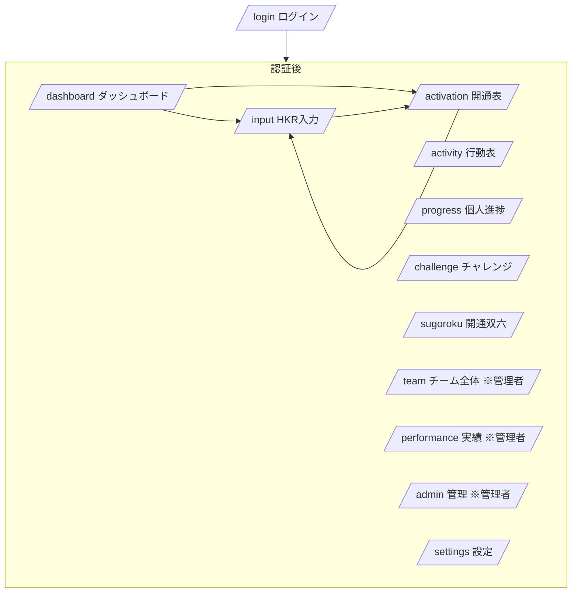
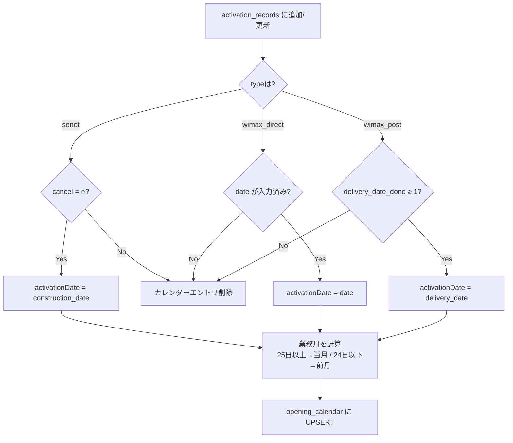

# 機能設計書 (Functional Design)

## システム構成

```
ブラウザ (Next.js 14 App Router / React)
    ↓ HTTPS
Vercel (サーバーレス Next.js)
    ↓ SSL
Neon PostgreSQL (クラウドDB)
```

---

## データモデル（ER図）



---

## 画面遷移図



---

## API設計

### 認証
| Method | Path | 説明 |
|--------|------|------|
| POST | /api/auth/login | ログイン |
| POST | /api/auth/logout | ログアウト |
| GET | /api/auth/me | 自分の情報取得 |

### HKRデータ
| Method | Path | 説明 |
|--------|------|------|
| GET | /api/records | 月次HKRデータ取得 |
| POST | /api/records | データ保存 |
| GET | /api/records/suggest | 開通表からの集計取得 |
| POST | /api/records/sync-all | 全員の開通表データ一括反映（管理者）|

### 開通表
| Method | Path | 説明 |
|--------|------|------|
| GET | /api/activation | レコード一覧取得 |
| POST | /api/activation | レコード追加 |
| PATCH | /api/activation | レコード更新（開通カレンダー同期） |
| DELETE | /api/activation | レコード削除 |
| POST | /api/activation/resync | 全レコードを開通カレンダーに再同期 |

### 開通カレンダー
| Method | Path | 説明 |
|--------|------|------|
| GET | /api/opening-calendar | 業務月のカレンダー取得 |
| POST | /api/opening-calendar | 手動エントリ追加 |
| PATCH | /api/opening-calendar | エントリ更新 |
| DELETE | /api/opening-calendar | エントリ削除 |

### 行動表
| Method | Path | 説明 |
|--------|------|------|
| GET | /api/daily-activity | 日次データ取得 |
| POST | /api/daily-activity | 日次データ保存 |

### その他
| Method | Path | 説明 |
|--------|------|------|
| GET | /api/products | 商材一覧 |
| GET/POST | /api/team | チームデータ |
| GET | /api/progress | 個人進捗 |

---

## 開通カレンダー同期フロー



---

## 業務月計算ロジック

```typescript
// 日付の日が25以上 → その月が業務月
// 日付の日が24以下 → 前月が業務月
function getBusinessMonth(date: Date): { year: number; month: number } {
  if (date.getDate() >= 25) return { year: date.getFullYear(), month: date.getMonth() + 1 }
  if (date.getMonth() === 0) return { year: date.getFullYear() - 1, month: 12 }
  return { year: date.getFullYear(), month: date.getMonth() }
}
```

---

## コンポーネント設計

| コンポーネント | 役割 |
|----------------|------|
| Sidebar | サイドナビ（PC固定・スマホドロワー）、並び替え機能つき |
| UserAvatar | アバター表示 |
| ActivationBadge | 開通数バッジ |
| HKRCard | HKR数値カード |
| RecentActivationFeed | 最近の開通フィード |
| TodayFollowAlerts | 今日のフォロー対象アラート |
| CelebrationOverlay | 達成時のお祝いアニメーション |
| WeeklyRankingCard | 週次ランキング |
| TableScrollContainer | テーブルの横スクロール対応ラッパー |
