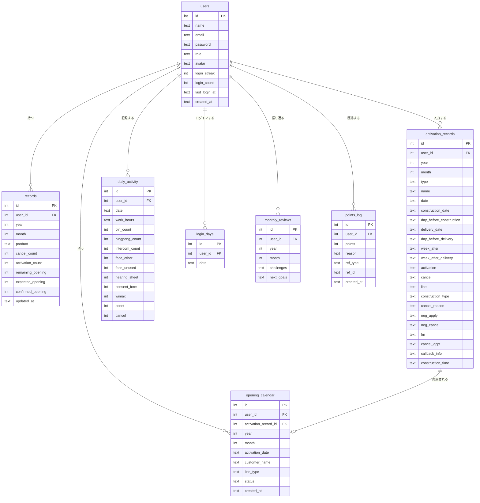
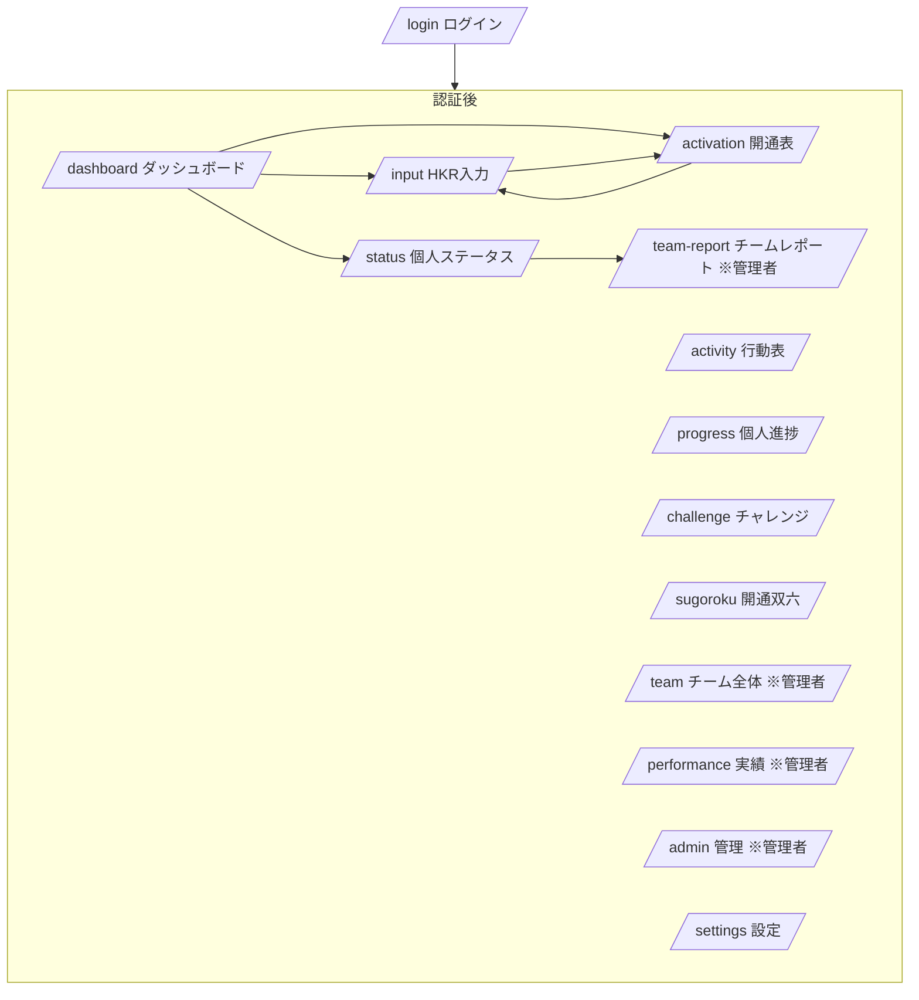
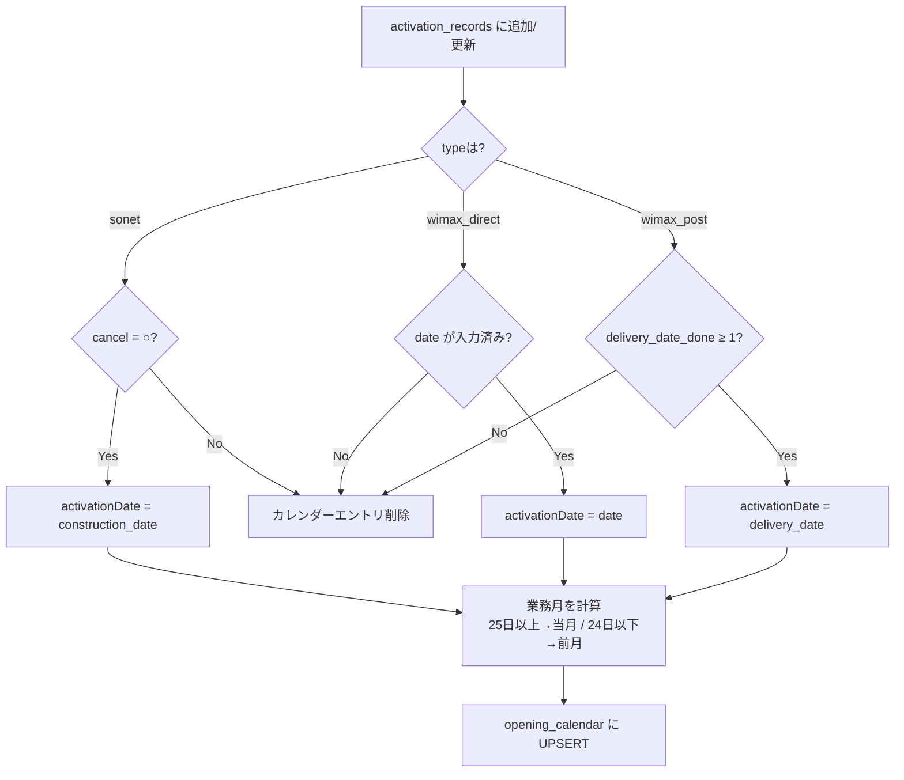

# 機能設計書 (Functional Design)

## システム構成

```
ブラウザ (Next.js 14 App Router / React)
    ↓ HTTPS
Vercel (サーバーレス Next.js)
    ↓ SSL
Neon PostgreSQL (クラウドDB)
```

---

## データモデル（ER図）



---

## 画面遷移図



---

## API設計

### 認証
| Method | Path | 説明 |
|--------|------|------|
| POST | /api/auth/login | ログイン（ストリーク更新含む） |
| POST | /api/auth/logout | ログアウト |
| GET | /api/auth/me | 自分の情報取得（ストリーク更新含む） |

### HKRデータ
| Method | Path | 説明 |
|--------|------|------|
| GET | /api/records | 月次HKRデータ取得 |
| POST | /api/records | データ保存 |
| GET | /api/records/suggest | 開通表からの集計取得 |
| POST | /api/records/sync-all | 全員の開通表データ一括反映（管理者） |

### 開通表
| Method | Path | 説明 |
|--------|------|------|
| GET | /api/activation | レコード一覧取得 |
| POST | /api/activation | レコード追加 |
| PATCH | /api/activation | レコード更新（開通カレンダー同期） |
| DELETE | /api/activation | レコード削除 |
| POST | /api/activation/resync | 全レコードを開通カレンダーに再同期 |

### 開通カレンダー
| Method | Path | 説明 |
|--------|------|------|
| GET | /api/opening-calendar | 業務月のカレンダー取得 |
| POST | /api/opening-calendar | 手動エントリ追加 |
| PATCH | /api/opening-calendar | エントリ更新 |
| DELETE | /api/opening-calendar | エントリ削除 |

### 行動表
| Method | Path | 説明 |
|--------|------|------|
| GET | /api/daily-activity | 日次データ取得 |
| POST | /api/daily-activity | 日次データ保存 |

### 個人ステータス
| Method | Path | 説明 | 権限 |
|--------|------|------|------|
| GET | /api/my/status | 7パラメーター・過去6ヶ月データ取得 | 全員（管理者は?userId指定可） |
| GET | /api/my/training | メンバー別スコア育成データ | 管理者のみ |
| GET | /api/score-ranking | 全員のスコアランキング | 全員 |

### チーム・実績
| Method | Path | 説明 | 権限 |
|--------|------|------|------|
| GET/POST | /api/team | チームデータ | 管理者 |
| GET | /api/report | チームレポート（週次・月次） | 管理者 |
| GET | /api/performance/ranking | 行動表ランキング | 全員 |
| GET | /api/progress | 個人進捗 | 全員 |

### その他
| Method | Path | 説明 |
|--------|------|------|
| GET | /api/products | 商材一覧 |

---

## 個人ステータスシステム

7つのパラメーターで個人の活動を評価する。各パラメーターは0〜100点でスコア化され、総合スコアは7パラメーターの平均（上限100点）。

| キー | 表示名 | 計算式 | データソース | 満点基準 | 方向 |
|------|--------|--------|------------|---------|------|
| acquisition | 獲得数 | (wimax+sonet)の月平均 | daily_activity（3ヶ月） | 20件/月 | 高いほど良い |
| activity | PP変換率 | (wimax+sonet)÷pingpong×100 | daily_activity（3ヶ月累計） | 1% | 高いほど良い |
| cancel | 解除量 | cancel_countの月平均 | records（3ヶ月） | 15件/月 | 高いほど良い |
| cancelRatio | 解除率 | cancel÷(wimax+sonet)×100 | daily_activity（3ヶ月） | 100% | 高いほど良い（獲得時に旧回線も解除できているか） |
| followup | 早期非キャンセル率 | activation='×'件数÷全件数×100の逆数 | activation_records（6ヶ月） | 0% | 低いほど良い |
| activation | 開通力 | activation_countの月平均 | records（3ヶ月） | 10件/月 | 高いほど良い |
| hkr | 定着率(HKR) | avg(activation÷cancel×100) | records（3ヶ月） | 80% | 高いほど良い |

### ランキング機能
- `/status` ページに総合スコア＋7パラメーター別の計8スライドカルーセルを表示
- 全メンバーを対象に順位付け（特定ユーザーを除外設定可能）
- 各パラメーター1位メンバーは「師匠」として表示→教える仕組みを促進

---

## 開通カレンダー同期フロー



---

## ログインストリーク

`lib/streak.ts` の `updateLoginStreak()` がログイン時・アプリ起動時（`/api/auth/me`）の両方で呼ばれる。

```
login_days テーブルに当日分をINSERT（ON CONFLICT DO NOTHING）
  → 当日初回のみ処理
  → 前日レコードがあれば streak +1、なければ streak = 1
  → users.login_streak, users.login_count, users.last_login_at を更新
```

---

## 業務月計算ロジック

```typescript
// 日付の日が25以上 → その月が業務月
// 日付の日が24以下 → 前月が業務月
function getBusinessMonth(date: Date): { year: number; month: number } {
  if (date.getDate() >= 25) return { year: date.getFullYear(), month: date.getMonth() + 1 }
  if (date.getMonth() === 0) return { year: date.getFullYear() - 1, month: 12 }
  return { year: date.getFullYear(), month: date.getMonth() }
}
```

---

## コンポーネント設計

| コンポーネント | 役割 |
|----------------|------|
| Sidebar | サイドナビ（PC固定・スマホドロワー）、並び替え機能つき |
| StatusRadarWidget | 個人ステータスのレーダーチャート（ダッシュボードに埋め込み） |
| UserAvatar | アバター表示 |
| ActivationBadge | 開通数バッジ |
| HKRCard | HKR数値カード |
| RecentActivationFeed | 最近の開通フィード |
| TodayFollowAlerts | 今日のフォロー対象アラート |
| CelebrationOverlay | 達成時のお祝いアニメーション |
| TableScrollContainer | テーブルの横スクロール対応ラッパー |
